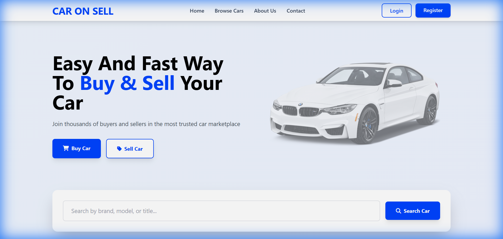

# 🚗 Car Buying and Selling Website

A robust, web-based Car Marketplace designed to connect buyers and sellers seamlessly. Built with PHP and MySQL, focusing on performance, security, and a modern user experience using Tailwind CSS.

> **🚀 Live Demo:** [http://mycarsite.rf.gd](http://mycarsite.rf.gd)
>
> ⚠️ **Note:** As this demo is hosted on free shared hosting (`.rf.gd`), some browsers (especially mobile) may incorrectly flag the domain as "Dangerous". This is a known false positive due to the hosting provider's shared reputation and does not reflect the safety of this project's code.

---

## 🚀 Key Features

### 👨‍💼 For Buyers
- **Advanced Search**: Filter cars by brand, model, price, and year.
- **Detailed Listings**: View high-quality images, specifications, and seller details.
- **Responsive Design**: Optimized for mobile, tablet, and desktop.
- **Secure Contact**: Direct communication with verified sellers.

### 🏷️ For Sellers
- **Seller Dashboard**: Manage your car listings, view stats, and enquiries.
- **Easy Listing**: Upload photos and details in a few clicks.
- **Status Tracking**: Monitor the status of your listings (Active, Sold, Pending).

### 🛡️ For Administrators
- **Admin Panel**: Complete oversight of users, listings, and platform activities.
- **User Management**: Approve/Ban sellers and verified users.
- **Content Moderation**: Review and approve listings before they go live.

---

## 🛠️ Technology Stack

- **Frontend**: HTML5, CSS3, Tailwind CSS, JavaScript (Vanilla)
- **Backend**: Native PHP 8.x
- **Database**: MySQL / MariaDB
- **Security**: Password Hashing, Prepared Statements (SQL Injection Prevention), Session Management

---

## 📥 Installation & Local Setup

1.  **Clone/Download** the repository to your XAMPP/WAMP `htdocs` folder.
2.  **Import Database**:
    *   Open phpMyAdmin (`http://localhost/phpmyadmin`).
    *   Create a database named `car_project`.
    *   Import `database/car_project.sql` (or similar file in `database/` folder).
3.  **Configure Database**:
    *   Edit `includes/db.php`.
    *   Set `$host`, `$user`, `$pass`, `$dbname` relevant to your local setup.
4.  **Run the Project**:
    *   Navigate to `http://localhost/car-selling-website-main/`.

---

## ☁️ Deployment (InfinityFree)

This project is optimized for zero-cost deployment on InfinityFree.

### Verified Configuration
- **Host**: `sqlXXX.infinityfree.com` (Check your CPanel)
- **PHP Version**: 7.4 / 8.2 (Supported)
- **Database**: Import via phpMyAdmin in VPanel.

**Quick Deploy Steps:**
1.  Upload all files to `/htdocs`.
2.  Import the SQL file via phpMyAdmin.
3.  Update `includes/db.php` with your VPanel credentials.

---

## 🔒 Security Measures

- **Authentication**: `password_hash()` used for storing credentials.
- **Database**: `mysqli` Prepared Statements used to prevent SQL Injection attempts.
- **Validation**: Server-side validation for all inputs to prevent XSS.
- **Access Control**: Role-based access (Buyer vs Seller vs Admin).

---

## 📬 Contributors
- **Developer**: Onkar Vyawahare
  
  

- **Developer**: Satyam Modi

  

